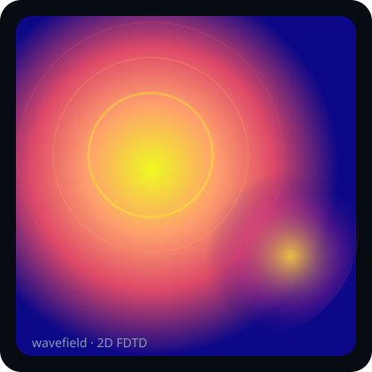

# wavefield

**2D finite-difference time-domain (FDTD) scalar wave simulator** — Python reference, C++ performance kernel, and a live TypeScript / Canvas heatmap.

A portfolio-ready computational-physics demo: one shared update scheme across three languages, CFL stability tests, Mur absorbing boundaries, and a browser visualization you can poke with the mouse.

[](https://github.com/SK090347/wavefield/actions/workflows/ci.yml)
[](LICENSE)
[](python/)
[](cpp/)
[](web/)

<p align="center">
  
</p>

---

## Mathematics / Formulation

Governing PDE — 2D acoustic / scalar wave equation:

$$
\frac{\partial^2 u}{\partial t^2} = c^2 \nabla^2 u
$$

Central-difference leapfrog (FDTD) on a uniform grid:

$$
\begin{aligned}
u^{n+1}_{i,j}
&=
2u^{n}_{i,j}-u^{n-1}_{i,j}
+r_x^2\bigl(u^{n}_{i+1,j}+u^{n}_{i-1,j}\bigr) \\
&\quad +r_y^2\bigl(u^{n}_{i,j+1}+u^{n}_{i,j-1}\bigr)
-2(r_x^2+r_y^2)\,u^{n}_{i,j}
\end{aligned}
$$

with Courant numbers $r_x = c\,\Delta t/\Delta x$, $r_y = c\,\Delta t/\Delta y$. For isotropic spacing the **CFL stability limit** is

$$
\frac{c\,\Delta t}{\Delta x} \le \frac{1}{\sqrt{2}}.
$$

Default runs target Courant ≈ 0.5 (safety margin inside the stable region).

### Mur absorbing boundaries

First-order Mur ABC (left face; others analogous):

$$
u^{n+1}_{0,j}
=
u^{n}_{1,j}
+\frac{c\Delta t-\Delta x}{c\Delta t+\Delta x}\bigl(u^{n+1}_{1,j}-u^{n}_{0,j}\bigr)
$$

### What is computed / conserved

| Quantity | Role |
|----------|------|
| Field $u$ | Scalar pressure / displacement amplitude |
| Discrete energy proxy | $\sum (u^n - u^{n-1})^2 + c^2\|\nabla u\|^2$ style monitor |
| $\max\|u\|$ | Blow-up detector for CFL tests |
| Mur drain | Outgoing energy leaves the domain (weak reflections) |

**Why this formula?** The wave equation + CFL bound is the canonical PDE numerics interview: discretize, prove stability, then open the domain with ABCs. Same stencil in Python / C++ / TS.

Extended notes: [docs/MATH.md](docs/MATH.md).

---

## Project layout

```
python/          NumPy reference solver + pytest (CFL / energy)
cpp/             C++17 kernel + CLI (subprocess-friendly frame dump)
web/             Vite + TypeScript live canvas heatmap
.github/         CI across Python, C++, and the web package
docs/            Preview asset + MATH.md
```

All three solvers share the **same stencil**, **same CFL rule**, and **same Mur ABC**.

## Quick start

### Python reference

```bash
cd python
python -m pip install -r requirements.txt
python -m pytest -q
python -m wavefield --nx 128 --ny 128 --steps 300 --boundary mur
```

Dump float32 frames for external viz / C++ cross-check:

```bash
mkdir -p /tmp/wf-frames
python -m wavefield --dump-dir /tmp/wf-frames --stride 4 --steps 200
```

### C++ kernel

```bash
cmake -S cpp -B cpp/build -DCMAKE_BUILD_TYPE=Release
cmake --build cpp/build -j
./cpp/build/wavefield_cpp --nx 128 --ny 128 --steps 300 --boundary mur
```

The binary speaks the same CLI flags as Python and can write `meta.bin` + `frame_XXXXX.f32` packs for offline playback.

Call it from Python via subprocess when you want speed without bindings:

```python
import subprocess
subprocess.run(["./cpp/build/wavefield_cpp", "--steps", "500", "--dump-dir", "frames"], check=True)
```

### Browser visualization

```bash
cd web
npm install
npm run dev      # http://localhost:5173
npm test
npm run build
```

- **Click** the canvas to inject Gaussian pulses  
- Toggle **Mur ABC** vs **Dirichlet**, scrub **CFL**, switch colormaps  
- Live stats: step, max |u|, discrete energy proxy, fps

## Tests

| Suite | What it guards |
|------|----------------|
| `python/tests/test_cfl.py` | Analytic 2D CFL limit; stable runs stay bounded; over-CFL blows up |
| `python/tests/test_energy.py` | Dirichlet energy does not explode; Mur drains outgoing energy |
| `python/tests/test_solver.py` | Symmetry, reset, API edge cases |
| `web/src/solver.test.ts` | TS port CFL helpers + finite evolution |

## Skills demonstrated

- **Computational physics** — FDTD discretisation, CFL analysis, Mur ABC  
- **Numerics** — leapfrog stability, discrete energy proxies, vectorized NumPy  
- **Systems / performance** — C++17 kernel with identical scheme, CLI frame I/O  
- **Interactive viz** — TypeScript Canvas heatmap, adaptive scaling, UX controls  
- **Engineering** — dual MIT/Apache licensing, pytest + Vitest, multi-language CI, math documented in-repo

## Topics

`fdtd` · `physics` · `python` · `cpp` · `typescript` · `simulation` · `portfolio`

## License

Dual-licensed under **MIT** OR **Apache-2.0** — see [LICENSE](LICENSE), [LICENSE-MIT](LICENSE-MIT), [LICENSE-APACHE](LICENSE-APACHE), and [NOTICE](NOTICE).

## Author

**Sumit Kumar Ta** ([SK090347](https://github.com/SK090347)) · Kolkata
